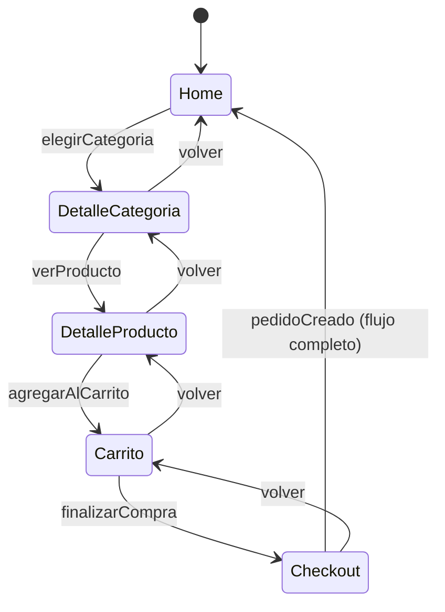

# Práctica P2-6 — Flujo e-commerce (maquetado React) + Backend GraphQL

> **Materia:** Programación Web 2 (PWII) · **Parcial 2 · Semana 2 · Práctica P2-6**
> **Modalidad:** Individual

> **P2-6** integra dos momentos del curso: el **maquetado del flujo del e-commerce
> (P2)** con **React + Vite**, y el **backend GraphQL (P6)** con entidades
> relacionadas, queries y mutations. Ambas partes se juntan en una sola entrega:
> el flujo de compra completo funcionando con datos reales de tu propio servidor.

---

## 1. ¿De qué se trata?

Construyes un e-commerce de demostración donde el **frontend** (React) presenta
un **flujo de compra** y el **backend** (GraphQL) sirve los datos y registra los
pedidos. Al final, el catálogo, el detalle y el checkout consumen **tu propio
servidor** — no datos falsos.

**Los tres frentes de la práctica:**

| Frente        | Es el momento | Qué aporta                                                               |
| ------------- | ------------- | ------------------------------------------------------------------------ |
| **Maquetado** | P2            | Flujo de templates del e-commerce con componentes, eventos y estado      |
| **Backend**   | P6            | Servidor GraphQL con schema, queries, mutations y entidades relacionadas |
| **Conexión**  | Ambas         | El frontend consulta el backend vía GraphQL                              |

---

## 2. Objetivo

Entregar el e-commerce donde el usuario **recorre el flujo de compra completo**:

```
Home → Detalle de categoría → Detalle de producto → Carrito → Checkout
```

- **Home** con estructura mínima: **TopBar, sidebar, hero, main, context, footer**.
- **Detalle de categoría:** productos de esa categoría.
- **Detalle de producto:** información del producto y elegir cantidad.
- **Carrito:** los productos elegidos con sus cantidades.
- **Checkout:** finalizar la compra, lo que crea un **Pedido** en el backend.

Todo el recorrido se controla con **eventos y estado** — como una **máquina de
estados**. No hay navegación por URLs: el flujo avanza porque un estado cambia
y los eventos del usuario deciden a dónde ir.

---

## 3. Recurso de referencia: el proyecto `Vite` (15 temas de React)

Se te comparte el proyecto **`Vite/`** (Aurora UI): una app-guía con **15 temas**
de React, cada uno con teoría, código y demo viva (corre con `npm install` +
`npm run dev` dentro de esa carpeta).

**Úsalo de inspiración:** revisa los temas y **pon en práctica la mayoría** en
tu maquetado. Esta tabla te dice dónde encaja cada uno:

| # | Tema del recurso | Dónde aplicarlo en P2-6 |
|--|--|--|
| 1 | **Componentes** | Cada pieza del flujo es un componente reutilizable |
| 2 | **Hooks** | Estado para el flujo; efectos para cargar datos del backend |
| 3 | **Padre → hijos (props)** | Pasar producto, categoría y cantidad de un template a sus hijos |
| 4 | **Eventos HTML** | Los clics y cambios de texto del catálogo, buscador y carrito |
| 5 | **Eventos custom** | Avisar al template superior cuando se elige categoría, producto o se agrega al carrito |
| 6 | **Drilling** | Verás su problema al pasar el carrito por props; lo resuelves con Context o store |
| 7 | **Fetching** | Pedir datos a tu servidor GraphQL de forma asíncrona |
| 8 | **Keys** | Identificar cada elemento de las listas de productos, categorías y carrito |
| 9 | **Fragment** | Agrupar secciones sin etiquetas extra dentro de tus templates |
| 10 | **Estilos** | Maquetado y responsividad de todos los templates |
| 11 | **Zustand** | Alternativa al Context: una tienda global para el carrito |
| 12 | **LINT** | Tu código pasa las reglas del linter sin errores |
| 13 | **useTransition** | Cambiar de template y cargar datos sin bloquear la interfaz |
| 14 | **Skeletons** | Esqueleto de carga mientras llegan los productos del backend |
| 15 | **Portales** | Si haces el detalle de producto como **modal** (ver sección 5) |

> ✅ **Regla del recurso:** no se trata de copiarlo, sino de **usar lo que
> explica**. Aplica al menos **8 de los 15 temas** y documéntalos en tu reporte.

---

## 4. Requisitos previos

### 4.1 Herramientas

| Herramienta | Versión | Verificación |
|---|---|---|
| **Node.js + npm** | 18+ | `node --version` / `npm --version` |
| **Lenguaje de backend a elección** | — | Instala el que elija tu equipo, siempre que tenga una **librería GraphQL madura** (ver tabla de la sección 6.1) |
| **Git** | cualquiera | `git --version` |
| **Editor** | — | VS Code recomendado |

> El frontend siempre es **Vite + React** (Node.js obligatorio). El backend lo
> eliges tú: Python, Node, Go, PHP, Java/Kotlin, Rust, C#… lo que sea, siempre
> que soporte GraphQL.

### 4.2 Tu DER del e-commerce

Ten claro tu **diagrama entidad-relación** antes de codificar. Entidades mínimas:

```
Categoria (id, nombre)
   1 ─── N   Producto (id, nombre, precio, imagen, stock)
Usuario (id, nombre, email, password, rol)
   1 ─── N   Pedido (id, fecha, total, status)
Pedido ── N ── Producto (detalle: cantidades)
```

Ese DER es la base del schema GraphQL del backend (sección 6).

---

## 5. Frontend — el maquetado del flujo (momento P2)

### 5.1 Crea el proyecto

```bash
npm create vite@latest
# Project name: ej. p26-front
# Select a framework: React
# Add TypeScript? Yes o No (a gusto)
cd p26-front
npm install
npm run dev
```

### 5.2 El flujo es una máquina de estados

Tu app NO tiene URLs: tiene un **estado que dice qué template se muestra** y
**eventos que lo cambian**.

**Las transiciones (eventos):**



Además del estado que indica el template visible, la máquina lleva **datos de
contexto** mientras avanza el flujo: la categoría elegida, el producto visto,
el contenido del carrito y los estados de carga y error de cada consulta.
Cada uno de ellos se actualiza mediante los eventos de la máquina (elegir,
ver, agregar, finalizar) y se comparte con los templates que lo necesitan.

El contenido visible se decide comparando el estado contra los templates:
se muestra el Home, el detalle de la categoría, el detalle del producto,
el carrito o el checkout según el estado en el que esté la máquina.

### 5.3 El layout y la estructura del Home

La app se arma con un **layout base** (diseño atómico visto en Web 1: átomos,
moléculas, organismos, templates). El Home mínimo:

```
┌─────────────┐
│   TopBar    │  ← logo, buscador, contador del carrito
├──────┬──────┤
│      │      │
│Side │ Main  │  ← sidebar: categorías
│ bar  │      │      main: hero + sección de productos
│      │      │
├──────┴──────┤
│   Footer    │
└─────────────┘
```

- **TopBar** — marca del e-commerce, buscador y el contador del carrito (vive
  el estado del carrito en el template raíz para que se refleje aquí).
- **Sidebar** — lista de categorías (dispara el evento de elegir categoría).
- **Hero** — encabezado visual del Home.
- **Main** — contenido principal (productos destacados / grid).
- **Context** — zona de contexto: mensajes, promociones o vista rápida del carrito.
- **Footer** — pie del layout.

### 5.4 Detalle de producto: a tu ingenio

El **detalle de producto** lo resuelves como prefieras:

- **Un template más del flujo** (un estado más de la máquina), o
- **Un modal** que se abre sobre el template actual (usa el tema 15 del recurso:
  **Portales**).

Ambas opciones valen. Documenta tu decisión en el reporte.

### 5.5 El carrito como dato compartido

El carrito lo usan varios componentes (TopBar, catálogo, detalle, checkout).
Dos caminos válidos (temas 6 y 11 del recurso):

- **Context API:** un proveedor de carrito envuelve el layout y todos los
  componentes acceden a él.
- **Zustand:** una tienda global del carrito con las acciones que necesites.

> Elige uno y quédate con él. Lo importante es que el **contador del TopBar**
> y el **Checkout** vean el mismo carrito.

---

## 6. Backend — servidor GraphQL (momento P6)

### 6.1 Un solo endpoint, lenguaje libre

Igual que en la práctica anterior: construyes un **servidor GraphQL** que
responde por **un solo endpoint** (`/graphql`), en el lenguaje que elijas:

| Lenguaje | Librería GraphQL |
|---|---|
| **Python** | Strawberry |
| **Node.js / TypeScript** | Apollo Server |
| Go | gqlgen |
| PHP | Lighthouse (Laravel) |
| Java / Kotlin | graphql-java / GraphQL Kotlin |

### 6.2 Base de datos real

El backend se conecta a una **base de datos real**. Dos opciones de entrega:

- Compartes el **`db.sql`** para que el profesor **replique** la base localmente
  (crea tablas + datos de ejemplo), **o**
- Compartes el **link de conexión a un recurso en la nube** (base remota).

En ambos casos deja las credenciales/configuración en un **`.env`** y documéntalo
en el README.

### 6.3 El schema SDL

Modela tu schema conforme a tu **DER**, con sus **relaciones**. Tu schema debe
definir:

- Un **tipo por cada entidad** del DER (categoría, producto, usuario, pedido y
  el detalle del pedido con sus cantidades), con los campos que ya tienes
  modelados.
- Las **relaciones entre entidades**: una categoría tiene muchos productos,
  un producto pertenece a una categoría, un usuario tiene varios pedidos y un
  pedido tiene varios productos con cantidades.
- Un **valor cerrado** (enum) para el rol del usuario.
- **Entradas de operaciones de escritura** (inputs) que agrupen los campos
  necesarios para crear o actualizar (por ejemplo, para registrar un producto
  o un pedido con sus renglones).
- Las **operaciones de lectura y escritura** del servidor (ver 6.4).

Cada tipo y campo se documenta con su **descripción** para que el playground
las muestre.

### 6.4 Operaciones que debe exponer el servidor

| Tipo de operación | Qué hace |
|--|--|
| Lectura | Listar las categorías y, de cada una, sus productos (consulta anidada) |
| Lectura | Consultar una categoría por su identificador |
| Lectura | Listar el catálogo de productos con paginación (cuántos trae y desde dónde) |
| Lectura | Consultar un producto por su identificador |
| Lectura | Consultar el historial de pedidos |
| Escritura | Registrar un producto nuevo |
| Escritura | Actualizar los datos de un producto |
| Escritura | Eliminar un producto |
| Escritura | Registrar un pedido con sus renglones (productos y cantidades) |

Los nombres de las operaciones siguen las convenciones de GraphQL estudiadas en
clase (una lectura no cambia estado; una escritura sí). La elección final de
vocabulario es tuya y se documenta en el reporte.

### 6.5 Resolvers y relaciones anidadas

Tu servidor recorre el árbol de la consulta **resolver por resolver**. Presta
atención a los **resolvers de campos** que resuelven relaciones:

- Los productos de una categoría se obtienen al consultar la categoría.
- La categoría de un producto se obtiene al consultar el producto.
- Los renglones de un pedido se obtienen al consultar el pedido (y cada renglón
  trae su producto).

> Ojo: al resolver listas con datos relacionados puedes caer en el **problema
> N+1** (una consulta extra por cada elemento). Déjalo documentado en el reporte:
> qué es, y cómo lo resolverías con una herramienta de agrupación (batch) o una
> consulta combinada (join).

---

## 7. Conexión front → back

Tu frontend deja los datos mock y **consume tu servidor** con peticiones
asíncronas a un solo endpoint.

### 7.1 Consultar el catálogo (lectura)

En el template del catálogo:

- Al montar el template, haces la **petición asíncrona** al endpoint del backend
  enviando la operación de lectura en el cuerpo de la petición.
- La respuesta trae **exactamente los campos que pediste** (por ejemplo, nombre,
  precio e imagen de cada producto).
- Guardas los datos en el estado del template.

Para las categorías del sidebar y el detalle del producto aplica el mismo
patrón: una petición asíncrona por cada operación de lectura que el template
necesite.

### 7.2 Registrar el pedido (escritura)

El **Checkout** usa la operación de escritura que registra un pedido:

- Al finalizar la compra, envías la operación con los **renglones del carrito**
  (cada producto con su cantidad).
- Si la operación responde correctamente, el **flujo regresa al Home** (el
  pedido quedó registrado en el backend).

### 7.3 Maneja carga y error

En cada template que consume datos: `cargando` → **Skeleton** (tema 14 del
recurso); `error` → mensaje claro con botón de reintentar.

---

## 8. Checklist antes de entregar

### Frontend
- [ ] Proyecto **Vite + React** (JS o TS a gusto).
- [ ] El flujo (`Home → Categoria → Producto → Carrito → Checkout`) funciona
      **por estado y eventos** — sin URLs.
- [ ] **Home** con TopBar, sidebar, hero, main, context y footer.
- [ ] Detalle de producto implementado (template del flujo **o** modal con
      Portal), decisión documentada.
- [ ] Carrito compartido (Context o Zustand) visible en el TopBar y en el Carrito.
- [ ] Estados de **carga y error** en el catálogo y el detalle.
- [ ] Aplicados **al menos 8 de los 15 temas** del recurso `Vite/` (ver sección 3).

### Backend
- [ ] Servidor GraphQL respondiendo por **un solo endpoint**.
- [ ] Schema que modela el DER: categoría, producto, usuario, pedido y detalle,
      con sus relaciones.
- [ ] Operaciones de lectura: listar categorías (con productos), consultar
      categoría, catálogo con paginación, consultar producto, historial de pedidos.
- [ ] Operaciones de escritura: registrar, actualizar y eliminar producto;
      registrar pedido con renglones.
- [ ] Resolvers de campos para las relaciones anidadas.
- [ ] Base de datos real conectada (`db.sql` replicable **o** link a nube).
- [ ] `README.md` con los pasos para correrlo.

### Conexión
- [ ] El catálogo y el detalle muestran datos del backend.
- [ ] El checkout registra un pedido real en el backend.
- [ ] Carga y error manejados en todas las consultas.

---

## 9. Entrega — dos zips

Entregas **dos archivos** en la tarea de Teams:

### Zip 1 — Código (`p26-codigo.zip`)

```
p26-codigo/
├── front/       → tu proyecto React (Vite)
├── back/        → tu servidor GraphQL
└── db.sql       → script de la base (o link a nube en el README)
```

- La estructura interna es **libre**, siempre y cuando el profesor pueda
  correrla con el **mínimo esfuerzo**.
- `front/README.md` y `back/README.md` con: instalación, variables de entorno
  (`.env`), y el comando para levantar cada parte.
- **Sin** `node_modules`.

### Zip 2 — Reportes (`p26-reportes.zip`)

Los **2 reportes** según `PlantillaReporte.md` + los **assets** que usen
(imágenes, diagramas) para el `reporte.md`:

```
p26-reportes/
├── reporte-p2.md        → reporte del maquetado
├── reporte-p6.md        → reporte del backend
└── assets/              → imágenes de los diagramas
```

---

## 10. Los dos reportes

### `reporte-p2.md` — Maquetado (momento P2)

1. **Portada**.
2. **Marco teórico:** componentes, props, estado, eventos, máquina de estados,
   Context/Zustand, diseño atómico.
3. **Diseño UML:** **diagrama de componentes** de lo que construiste (TopBar,
   Sidebar, templates, store).
4. **Conclusión.**

### `reporte-p6.md` — Backend (momento P6)

1. **Portada**.
2. **Marco teórico:** GraphQL, schema, consultas vs mutaciones, entrada,
   resolver, relaciones, problema N+1.
3. **Diseño UML:** **diagrama de entidades (DER)** y tu SDL.
4. **Conclusión.**

> ⚠️ **Sin reportes no se califica.**

---

## 11. Regla de integridad

**Prácticas idénticas:** si dos o más entregas presentan implementaciones
idénticas o casi idénticas, la calificación de esa implementación **se divide
entre todos los casos que cumplan**: si N alumnos entregan lo mismo, cada uno
recibe la calificación dividida entre N (1/2, 1/3, …). El código y el reporte
deben ser tu trabajo.

---

## 12. FAQ

**¿Puedo dejar el carrito sin persistir al recargar?**
Sí. La persistencia (localStorage) se ve más adelante; en esta práctica el
carrito vive en memoria mientras dura la sesión de uso.

**¿El buscador es obligatorio?**
El Home mínimo pide TopBar con buscador. Puedes implementar el filtro simple
por nombre (un buen lugar para el tema 6 del recurso: eventos HTML con entrada
controlada).

**¿Puedo usar una API externa además de mi backend?**
No hace falta. El catálogo y los pedidos son de tu propio servidor.

**¿Puedo definir roles y login?**
No es obligatorio en esta práctica (se ve en la práctica de autenticación). Si
tu equipo ya tiene login, la operación que registra el pedido puede recibir un
usuario fijo por ahora.

**¿Qué pasa si mi librería GraphQL no soporta algo del schema?**
Acomódalo a la documentación oficial de tu librería y avisa al profesor por
Teams. En clase se valida el **QUÉ** (esquema y operaciones correctos), no el
lenguaje.

---

¡Éxito construyendo tu primer e-commerce full-stack! 🚀