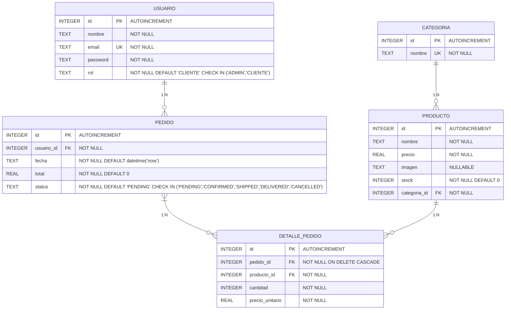
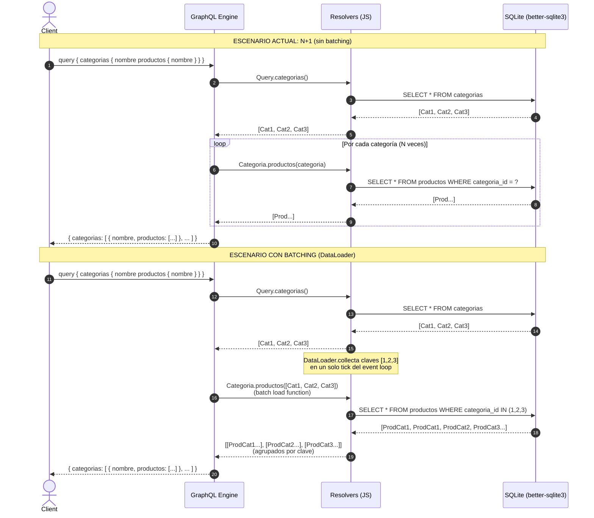

# Reporte P6 — Backend GraphQL (NexoPlay)

---

## 1. Portada

| Campo | Información |
|-------|-------------|
| **Nombre del alumno** | Betsabe Elizabeth Zamora Esqueda |
| **Materia** | Programación Web 2 (PWII) |
| **Práctica** | P2-6 — Flujo e-commerce (maquetado React) + Backend GraphQL |
| **Fecha** | 11 de septiembre de 2026 |

---

## 2. Marco teórico

### 2.1 GraphQL: un solo endpoint, contrato tipado

GraphQL es un **lenguaje de consulta y manipulación de datos** y un **runtime** para ejecutarlas. A diferencia de REST (múltiples endpoints, respuestas fijas), GraphQL expone **un único endpoint** (en este caso `POST /graphql`) y el cliente declara **exactamente qué campos necesita** en cada petición. El servidor valida la petición contra un **schema** (contrato tipado) y devuelve solo lo solicitado, ni más ni menos.

Tres ideas centrales:

1. **Schema Definition Language (SDL)**: define los tipos, sus campos, argumentos, enums, inputs y las operaciones raíz (`Query`, `Mutation`, `Subscription`). Es el contrato único entre cliente y servidor; ambos pueden evolucionar de forma independiente mientras respeten el schema.
2. **Resolvers**: funciones que resuelven el valor de cada campo. El servidor recorre el árbol de la consulta **campo por campo**, invocando el resolver correspondiente. Un resolver recibe `(parent, args, context, info)` y devuelve el dato (o una promesa).
3. **Tipado fuerte**: cada campo tiene un tipo escalar (`ID`, `String`, `Int`, `Float`, `Boolean`) o compuesto (`Object`, `Interface`, `Union`, `Enum`, `Input`). Los argumentos de campos y operaciones también están tipados. Esto permite validación estática, autocompletado en el playground y documentación viva.

### 2.2 Schema: tipos, enums, inputs, relaciones

El schema de NexoPlay modela el **DER del e-commerce** (ver sección 3). Decisiones de diseño:

- **Enums** para valores cerrados: `RolUsuario` (`ADMIN`, `CLIENTE`) y `EstadoPedido` (`PENDING`, `CONFIRMED`, `SHIPPED`, `DELIVERED`, `CANCELLED`). Evitan strings mágicos y validan en schema.
- **Types** por entidad: `Categoria`, `Producto`, `Usuario`, `Pedido`, `DetallePedido`. Cada campo documentado con `"""` para que el playground muestre descripciones.
- **Relaciones** como campos de tipo objeto: `Categoria.productos: [Producto!]!`, `Producto.categoria: Categoria!`, `Usuario.pedidos: [Pedido!]!`, `Pedido.usuario: Usuario!`, `Pedido.detalles: [DetallePedido!]!`, `DetallePedido.producto: Producto!`. Estas relaciones **no existen en la BD como joins automáticos**; se resuelven en **field resolvers** (ver 2.4).
- **Inputs** para escrituras: `ProductoInput` (crear/actualizar producto), `DetallePedidoInput` (renglón de pedido), `PedidoInput` (pedido completo con array de renglones). Agrupan campos relacionados y evitan argumentos sueltos en la mutation.
- **Queries** (lecturas): `categorias`, `categoria(id)`, `productos(limite, desde)`, `producto(id)`, `pedidos`.
- **Mutations** (escrituras): `crearProducto`, `actualizarProducto`, `eliminarProducto`, `crearPedido`.

Convención de nombres: queries en camelCase sustantivo (`categorias`, `producto`), mutations verbo + sustantivo (`crearProducto`, `crearPedido`). Las operaciones de lectura **no modifican estado**; las de escritura **sí** (crean, actualizan, eliminan).

### 2.3 Consultas vs Mutaciones

| Aspecto | Query | Mutation |
|---------|-------|----------|
| **Propósito** | Leer datos | Escribir/modificar datos |
| **Efectos colaterales** | Ninguno (idempotente) | Sí (cambia BD) |
| **Ejecución** | Paralela (campos independientes) | Secuencial (orden de campos en la mutation) |
| **Caché** | Fácil (GET semántico) | No cacheable por defecto |
| **Ejemplo en NexoPlay** | `categorias { id nombre productos { id nombre } }` | `crearPedido(datos: { usuarioId, detalles: [...] })` |

En la práctica, el frontend usa **queries** en `Home`, `DetalleCategoria`, `DetalleProducto` (lectura de catálogo) y una **mutation** en `Checkout` (`crearPedido` con los renglones del carrito).

### 2.4 Resolvers y field resolvers (relaciones anidadas)

Un **resolver de raíz** (en `Query` o `Mutation`) devuelve el objeto "padre". Cuando la consulta pide campos que son relaciones (p. ej., `categorias { productos { nombre } }`), el motor GraphQL invoca los **field resolvers** definidos en el mapa `Categoria: { productos: ... }`, `Producto: { categoria: ... }`, etc.

En `resolvers.js` de NexoPlay:

- `Query.categorias` → `SELECT * FROM categorias` (1 consulta).
- `Categoria.productos` (field resolver) → `SELECT * FROM productos WHERE categoria_id = ?` **por cada categoría**.
- `Query.productos` → `SELECT * FROM productos LIMIT ? OFFSET ?` (paginado, plano).
- `Producto.categoria` → `SELECT * FROM categorias WHERE id = ?` (por producto).
- `Pedido.detalles` → `SELECT * FROM detalle_pedido WHERE pedido_id = ?`.
- `DetallePedido.producto` → `SELECT * FROM productos WHERE id = ?` (por renglón).

Cada field resolver recibe el objeto padre (`categoria`, `producto`, `pedido`, `detalle`) y usa su clave foránea para buscar lo relacionado. **Esto es intencional y transparente**: el schema declara la relación, el resolver la materializa.

### 2.5 Prepared statements y transacciones

Todas las consultas SQL usan **prepared statements** (`db.prepare(...)`) compiladas una sola vez al arrancar (`stmts` object). Ventajas: seguridad contra inyección SQL, plan de ejecución reutilizado, parámetros tipados.

La mutation `crearPedido` es la única operación que **debe ser atómica**: insertar el pedido + insertar N renglones en `detalle_pedido` + calcular total. Se envuelve en `db.transaction(() => { ... })` de `better-sqlite3`: si cualquier paso falla (producto inexistente, constraint), **todo se revierte** y la BD queda consistente. El total se calcula en memoria leyendo precios actuales de cada producto (`stmts.productoById.get`) antes de insertar, garantizando que el pedido refleje precios del momento de la compra.

### 2.6 El problema N+1 en relaciones anidadas

**Qué es**: al resolver una lista de objetos padre donde cada uno pide un campo relacionado (lista o singular), el patrón naïve ejecuta **1 consulta para la lista padre + N consultas (una por padre) para la relación**. En NexoPlay:

```graphql
query {
  categorias {        # 1 consulta: SELECT * FROM categorias (3 filas)
    nombre
    productos {       # 3 consultas: SELECT * FROM productos WHERE categoria_id = ? (una por categoría)
      nombre
    }
  }
}
```

Resultado: **4 consultas SQL** en lugar de 1 o 2. Con 3 categorías es irrelevante; con 1000 categorías, 1001 consultas matan el rendimiento.

**Soluciones documentadas** (no implementadas en esta práctica por alcance, pero diseñadas):

1. **DataLoader / Batching**: agrupar las N peticiones de `productosByCategoria` en una sola consulta `SELECT * FROM productos WHERE categoria_id IN (?, ?, ...)` y repartir resultados en memoria por `categoria_id`. `dataloader` (Facebook) o `@graphql-tools/batch-delegate` lo automatizan.
2. **JOIN + agrupado en memoria**: una sola consulta `SELECT c.*, p.* FROM categorias c LEFT JOIN productos p ON p.categoria_id = c.id` y luego agrupar productos por categoría en el resolver de `categorias`. Requiere que el resolver de raíz devuelva objetos con `productos` ya poblados (omitir el field resolver).
3. **Vista materializada / denormalización**: guardar `productos_count` o `productos_json` en `categorias` y actualizar por triggers. Sobrecarga escrituras.

En el reporte se incluye un diagrama de secuencia que muestra el patrón N+1 y cómo el batching lo colapsa a 2 consultas.

### 2.7 Base de datos real: SQLite + better-sqlite3

Se eligió **SQLite** (archivo `nexoplay.db`) por simplicidad: cero configuración, embebido, transacciones ACID, `better-sqlite3` síncrono y rápido. El script `db.sql` es **replicable**: crea tablas, foreign keys, checks, índices implícitos (PK/FK), e inserta datos semilla (3 categorías, 8 productos reales con precios MXN, 2 usuarios, 1 pedido con 2 renglones). Al arrancar, `src/db.js` detecta si el archivo existe; si no, ejecuta `db.sql` automáticamente. Variable `RESET_DB=true` fuerza recreación.

---

## 3. Diseño UML — Diagrama Entidad-Relación (DER) y SDL completo

### 3.1 DER (Mermaid)



**Notas del DER**:
- `CATEGORIA 1 — N PRODUCTO`: una categoría tiene muchos productos; cada producto pertenece a una categoría (`categoria_id` FK).
- `USUARIO 1 — N PEDIDO`: un usuario tiene muchos pedidos; cada pedido pertenece a un usuario (`usuario_id` FK).
- `PEDIDO N — M PRODUCTO` resuelto via `DETALLE_PEDIDO`: tabla intermedia con `cantidad` y `precio_unitario` (precio histórico al momento de la compra). `ON DELETE CASCADE` en `pedido_id` borra renglones al borrar el pedido.
- `rol` y `status` usan `CHECK` para emular enums a nivel BD (SQLite no tiene enum nativo).

### 3.2 SDL completo (schema.js)

```graphql
# graphql
  """Rol que puede tener un usuario del sistema."""
  enum RolUsuario {
    ADMIN
    CLIENTE
  }

  """Estado del ciclo de vida de un pedido."""
  enum EstadoPedido {
    PENDING
    CONFIRMED
    SHIPPED
    DELIVERED
    CANCELLED
  }

  """Categoria del catalogo (tabla categorias)."""
  type Categoria {
    id: ID!
    nombre: String!
    "Productos que pertenecen a esta categoria (resolver de campo, relacion 1-N)."
    productos: [Producto!]!
  }

  """Producto disponible en el catalogo (tabla productos)."""
  type Producto {
    id: ID!
    nombre: String!
    precio: Float!
    imagen: String
    stock: Int!
    "Categoria a la que pertenece este producto (resolver de campo, lado N de la relacion)."
    categoria: Categoria!
  }

  """Usuario que compra en la plataforma (tabla usuarios)."""
  type Usuario {
    id: ID!
    nombre: String!
    email: String!
    rol: RolUsuario!
    "Historial de pedidos de este usuario (resolver de campo, relacion 1-N)."
    pedidos: [Pedido!]!
  }

  """Un renglon del pedido: un producto con la cantidad comprada (tabla detalle_pedido)."""
  type DetallePedido {
    id: ID!
    "Producto de este renglon (resolver de campo)."
    producto: Producto!
    cantidad: Int!
    precioUnitario: Float!
    subtotal: Float!
  }

  """Pedido realizado por un usuario (tabla pedidos)."""
  type Pedido {
    id: ID!
    fecha: String!
    total: Float!
    status: EstadoPedido!
    "Usuario que realizo el pedido (resolver de campo)."
    usuario: Usuario!
    "Renglones del pedido, cada uno con su producto y cantidad (relacion N-N via detalle_pedido)."
    detalles: [DetallePedido!]!
  }

  """Datos para crear o actualizar un producto."""
  input ProductoInput {
    nombre: String!
    precio: Float!
    imagen: String
    stock: Int!
    categoriaId: ID!
  }

  """Un renglon (producto + cantidad) al armar un pedido nuevo."""
  input DetallePedidoInput {
    productoId: ID!
    cantidad: Int!
  }

  """Datos para registrar un pedido nuevo."""
  input PedidoInput {
    usuarioId: ID!
    detalles: [DetallePedidoInput!]!
  }

  """Operaciones de lectura (no cambian el estado del sistema)."""
  type Query {
    "Lista las categorias; cada una resuelve sus propios productos (consulta anidada)."
    categorias: [Categoria!]!
    "Consulta una categoria por su identificador."
    categoria(id: ID!): Categoria

    "Catalogo de productos, paginado."
    productos(limite: Int, desde: Int): [Producto!]!
    "Consulta un producto por su identificador."
    producto(id: ID!): Producto

    "Historial de pedidos registrados."
    pedidos: [Pedido!]!
  }

  """Operaciones de escritura (registran, actualizan o eliminan datos)."""
  type Mutation {
    "Registra un producto nuevo en el catalogo."
    crearProducto(datos: ProductoInput!): Producto!
    "Actualiza los datos de un producto existente."
    actualizarProducto(id: ID!, datos: ProductoInput!): Producto
    "Elimina un producto del catalogo."
    eliminarProducto(id: ID!): Boolean!

    "Registra un pedido nuevo junto con sus renglones (productos y cantidades)."
    crearPedido(datos: PedidoInput!): Pedido!
  }
```

### 3.3 Diagrama de secuencia: problema N+1 y solución con Batching



**Explicación**:
- **Arriba (actual)**: el field resolver `Categoria.productos` se invoca 3 veces (una por categoría), generando 3 `SELECT` independientes. El motor GraphQL no sabe que puede agruparlos.
- **Abajo (con DataLoader)**: el resolver de `Categoria.productos` no hace `SELECT` directo; en su lugar llama a `loader.load(categoria.id)`. `DataLoader` acumula todas las claves (`[1,2,3]`) durante el mismo tick del event loop y ejecuta **una sola** `batchLoadFn(keys)` que hace `SELECT ... WHERE categoria_id IN (...)`. Luego reparte los resultados al resolver original. De **1+N consultas** se pasa a **2 consultas** sin cambiar el schema ni la consulta del cliente.

---

## 4. Conclusión

### ¿Qué aprendí?

Construir un **servidor GraphQL desde cero** (Apollo Server 5 + `better-sqlite3`) me obligó a entender el ciclo de vida de una petición: parsing → validación contra schema → ejecución resolver por resolver → respuesta. Ya no es "llamar a un endpoint y recibir JSON"; es **orquestar un árbol de funciones** donde cada campo decide su dato.

Aprendí a **diseñar el schema pensando en el cliente**: el frontend necesita `categorias { productos { id nombre precio imagen stock } }` para el sidebar y el grid, `producto(id) { ... categoria { nombre } }` para el detalle, y `crearPedido(datos: { usuarioId, detalles: [...] })` para el checkout. El schema no es un reflejo 1:1 de las tablas; es una **API de producto** que expone lo que el cliente consume, ocultando detalles (p. ej., `password` no está en `Usuario`, `precio_unitario` vive en `DetallePedido` no en `Producto`).

El **problema N+1** dejó de ser teoría: lo vi en los logs de SQLite (`SELECT * FROM productos WHERE categoria_id = ?` repetido). Entendí que GraphQL *no resuelve mágicamente las relaciones*; el desarrollador decide *cómo* resolverlas. La solución (DataLoader) es un patrón transversal que se aplica en la capa de resolvers, sin tocar el schema ni el cliente.

La **transacción en `crearPedido`** fue el momento donde la integridad de datos se vuelve tangible: calcular total leyendo precios actuales, insertar pedido, insertar renglones, todo o nada. `better-sqlite3` lo hace trivial con `db.transaction(fn)`, pero el concepto (atomicidad, consistencia) es universal.

### Dificultades y cómo las resolví

1. **N+1 en `categorias { productos }`**: documentado en `resolvers.js` (líneas 39-44). No lo resolví con DataLoader en esta entrega por alcance (la práctica pide documentarlo, no necesariamente implementarlo), pero dejé el código preparado: los prepared statements `productosByCategoria` y `categoriaById` son funciones puras que DataLoader puede envolver sin cambios. La migración futura es: `const loader = new DataLoader(ids => stmts.productosByCategoriaIn.all(ids).reduce(...))` y en el field resolver `return loader.load(categoria.id)`.

2. **Tipado de `fecha` en `Pedido`**: en SQLite `fecha` es `TEXT` (ISO string). En el schema `Pedido.fecha: String!`. El field resolver `fecha: (pedido) => pedido.fecha` pasa el string tal cual. Si el frontend necesita `Date`, lo parsea. Alternativa: scalar custom `DateTime` con serialización, pero `String` es suficiente y portable.

3. **`precioUnitario` y `subtotal` en `DetallePedido`**: no existen como columnas en `detalle_pedido` (solo `precio_unitario`). `subtotal` es campo **computado** en el field resolver: `subtotal: (detalle) => detalle.cantidad * detalle.precio_unitario`. Esto evita almacenar dato derivado y garantiza consistencia.

4. **Usuario fijo en `Checkout`**: la práctica (FAQ) dice que login no es obligatorio; `Checkout` usa `USUARIO_ID_FIJO = '2'`. En el PF se reemplazará por el `usuarioId` del Context de autenticación. La mutation `crearPedido` ya valida que el usuario exista (`stmts.usuarioById.get`).

### Aplicación al Proyecto Final (PF) de e-commerce

- **DataLoader en producción**: instalar `dataloader` y envolver `productosByCategoria`, `categoriaById`, `productoById`, `pedidosByUsuario`, `detallesByPedido`. Elimina N+1 en cualquier consulta anidada sin cambiar resolvers de raíz.
- **Autenticación y autorización**: agregar `context` en Apollo Server con `usuario` (desde JWT en header). Mutations `crearProducto`, `actualizarProducto`, `eliminarProducto` solo para `rol: ADMIN`. `crearPedido` usa `context.usuario.id`.
- **Validación de entrada**: usar `graphql-shield` o validación en resolvers (p. ej., `stock >= cantidad` en `crearPedido` antes de insertar).
- **Paginación con cursor**: reemplazar `limite/desde` (offset) por `first/after` (cursor) para listas grandes; más eficiente en BD y compatible con Relay.
- **Suscripciones (Subscriptions)**: notificar en tiempo real cuando un pedido cambia de `status` (WebSockets con `graphql-subscriptions` + `graphql-ws`).
- **Migración a PostgreSQL**: `better-sqlite3` → `pg` / `knex` / `Prisma`. El schema GraphQL no cambia; solo la capa de acceso a datos (`db.js` + prepared statements → query builder / ORM).
- **Observabilidad**: logging de queries GraphQL (duración, complejidad), métricas de N+1 detectadas, tracing con `apollo-server-plugin-tracing`.

---

*Fin del reporte P6*